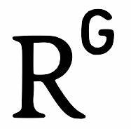

  

    Hi, welcome to my webpage!
 
 
 
  
  
   <h1 align="center">  
  
  
  
  
  </h1>
  
  
  <h1 align="center">Giorgia Zaccaria</h1>
  <h3 align="center">Postdoctoral Research Fellow</h3>
  <h3 align="center"><a href="https://www.dismeq.unimib.it/it" target="_blank">University of Milano-Bicocca</a></h3> 

  
## News

**October 2022**
- **Conference and talk** - The **CESS 2022** conference days are approaching! (October 20-21, 2022, Department of Statistical Sciences, Sapienza University of Rome). \
Have a look at conference website (<a href="https://cess2022.dss.uniroma1.it/event/3/" target="_blank">CESS2022 website</a>). Registration is still open.
You can see the programme of the conference <a href="https://drive.google.com/file/d/1Om-ezLIFd2VJHHalOgV9lOxm1kJ5HfRa/view" target="_blank">here</a>.

**August 2022**
- **New paper!** – Our work with <a href="https://carlocavicchia.github.io" target="_blank">Carlo Cavicchia</a> and Maurizio Vichi entitled _Hierarchical Disjoint Principal Component Analysis_ has been published in _ASta Advances in Statistical Analysis_. Click on the <a href="https://link.springer.com/epdf/10.1007/s10182-022-00458-4?sharing_token=_hQdKnmPFjEiTAqgbN2MwPe4RwlQNchNByi7wbcMAY6LYFaEoM6VNzVm_6t61nksuxr6EPPiGVwU6PicfEIvCcwsrUq7yaNa9WQzUyPun_V9On5NlGbz30_ypdjEBCIgjYb3g-Cvc04PODwPPrMc4zNZnMkfDhKQS4j-cRmC6zA%3D" target="_blank">link</a> to read it!

**July 2022**
- **Talk** - I am looking forward to join the <a href="https://ifcs2022.fep.up.pt/" target="_blank">17th conference of the International Federation of Classification Societies</a>, where I will present our work on GMM with ultrametric covariance structures and its extension to more parsimonious cases.

**Mar 2022**
- **CESS 2022** - I am glad to announce the <a href="https://cess2022.dss.uniroma1.it/event/3/abstracts/" target="_blank">call for abstracts</a> of the <a href="https://cess2022.dss.uniroma1.it/event/3/" target="_blank">**Conference of European Statistics Stakeholders 2022**</a> as member of the Local Organizing Committee. The conference will be held at the Department of Statistical Sciences of Sapienza University of Rome on October 20-21, 2022. \
Registration is open and **no registration fee is required**. I hope to see you at the conference!

**Feb 2022**
- **New paper!** - Our paper with <a href="https://carlocavicchia.github.io" target="_blank">Carlo Cavicchia</a> and Maurizio Vichi entitled _Gaussian mixture model with an extended ultrametric covariance structure_ has been published in _Advances in Data Analysis and Classification_. Click on the <a href="https://link.springer.com/article/10.1007/s11634-021-00488-x" target="_blank">link</a> to read it!

  
 
