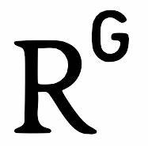

  

    Hi, welcome to my webpage!
 
 
 
  
  
   <h1 align="center">  
  
  
  
  
  
  </h1>
  
  
  <h1 align="center">Giorgia Zaccaria</h1>
  <h3 align="center">Tenure-Track Assistant Professor (RTT)</h3>
  <h3 align="center"><a href="https://www.unimib.it/giorgia-zaccaria" target="_blank">University of Milano-Bicocca</a></h3> 

  
## News
**July 2026** 

- I am honoured to receive the 2026 Chikio Hayashi Award from International Federation of Classification Societies (IFCS), recognizing young researchers working in the field of classification and clustering.

- I joined the Editorial Board of the _Journal of Classification_. Many thanks to the Editor-in-Chief, Prof. Paul McNicholas, for inviting me to serve on the board.

